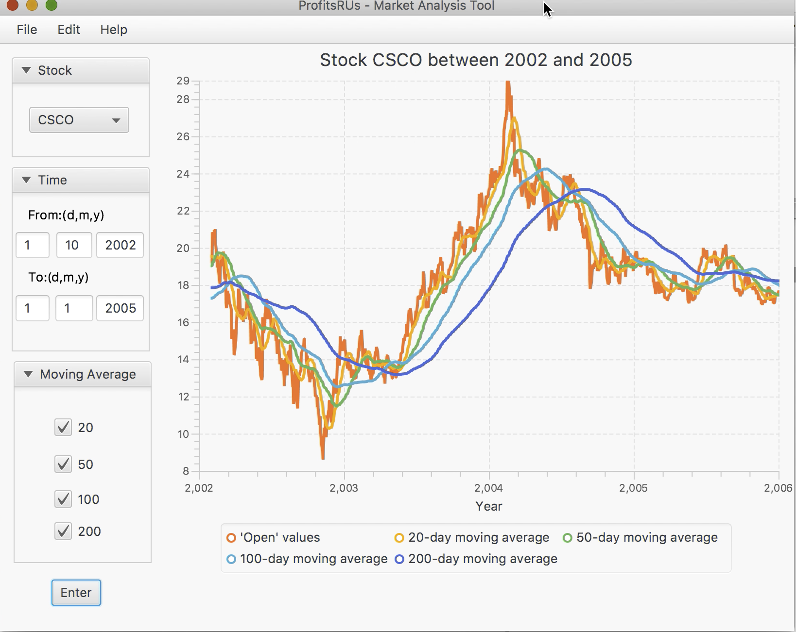

# stock_analysis-software
According to moving average line to analysis best sell and buy point

## Project Objective
- Providing ProfitsRUS with a new technical analysis software for the stock market 
to guide user when to buy or sell a stock

## Techniques
### Stock Technical Analysis
- [SMA](http://www.onlinetradingconcepts.com/TechnicalAnalysis/MASimple.html) 
- [EMA](http://www.onlinetradingconcepts.com/TechnicalAnalysis/MAExponential.html)
- [Related File](./technical_tutorial_de.pdf)

### Programming Language
- Java

### Design Tool
- Eclipse
- JavaFX
- Visual Paradigm
- Sparx
- [YahooFinancial API](https://www.npmjs.com/package/yahoo-finance)

### Software Interface

